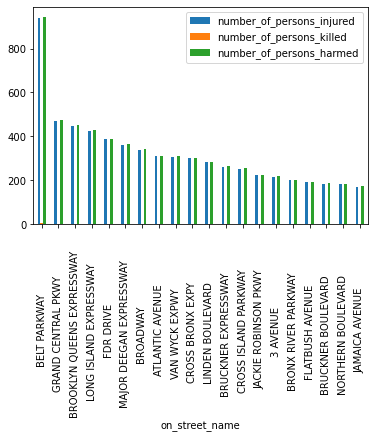

# Data preprocessing - NYC Motor Vehicle Crashes

This project outcome belongs to **Gülce Padem** who is currently a junior Data Scientist/AI Operator in making at BeCode's Theano 2.27 promotion.

**Repository:** nyc-crashes
**Type of Challenge:** Consolidation
**Duration:** 2 days
**Deadline:** 10/03/2021 05:00 PM
**Deployment strategy:** Github page
**Team challenge:** solo

## Mission objectives

* Be able to use pandas
* Be able to clean a data set
* Be able to do prepare a data set for a machine learning model

### The Mission

Bill de Blasio, mayor of New York City, is in a bit of a pickle. Indeed, his police department, the NYPD, collected information about all the traffic accidents that happened in New York City. However, they are too busy eating doughnuts to correctly encode each traffic indicent, and so it happens that the dataset that we got here is quite dirty, has a lot of missing values and can't be used by a machine learning model as is. It is requested to have a clean dataset.

### Table of Contents

* Installation
* Repository
* Visual
* Pending things to do
* Collaboration

#### Installation

#### Repository

There are two branches under the repository.

* main
* development

##### Main Branch

The structure:

* README.md
* data_clean_GOOD_ENOUGH.csv
* data_clean_GOOD_ENOUGH.ipynb
* .gitignore
* graph_nyc_crashes_streets.png

**README.md**
You are reading it now. It is important to read the whole file before forking or cloning.

**data_clean_GOOD_ENOUGH.csv**
This file is a good enough cleaned version of the original dataset that was received. This file gives a rough information about the most dangerous streets of New York. A lot of missing values were discarded to get to this version of the dataset. Hence, the accuracy is not very high. However, this cleaned dataset still gives a good indication of the most dangerous streets. To decide which streets are the most dangerous, number of people who were injured and number of people who were killed were used as indicators.

**data_clean_GOOD_ENOUGH.ipynb**
This Jupyter notebook is where the results of each step of the code to deduct a cleaner dataset is visible. If you would like to inspect more on the outcomes of the different parts of the code, I recommend the use of the notebook.

**.gitignore**
This file is to ignore the notebook checkpoints.

**graph_nyc_crashes_streets.png**
Image of the graph that shows the 20 most dangerous streets in New York.

##### Development Branch

**nyc-crashes.ipynb**
This Jupyter notebook is the first notebook to examine the dataset in its general. Different methods are tried to see what kind of approached can be followed to reach a meaningful dataset. It is still a work in progress. This notebook is only recommended to look at if one wants to see different approaches and develop them further.

#### Visual

#### Pending things to do

To achieve a cleaner dataset, only the on street names were used as an indicator of the streets where an accident happened. Not every element had this value in the dataset, hence a lot of information was discarded. However, there are different possibilities to have a street name value for every element. All the elements have coordinates in the dataset. This very valuable because it is possible to extract a streetname with the use of an API for every accident in the dataset. This way we can reach a much cleaner and reliable dataset. Since this operation is time consuming and the project had a rather short time frame this objective will be achieved later on.

#### Collaboration

This project is open to collaborations as well as forking or cloning for further development.
